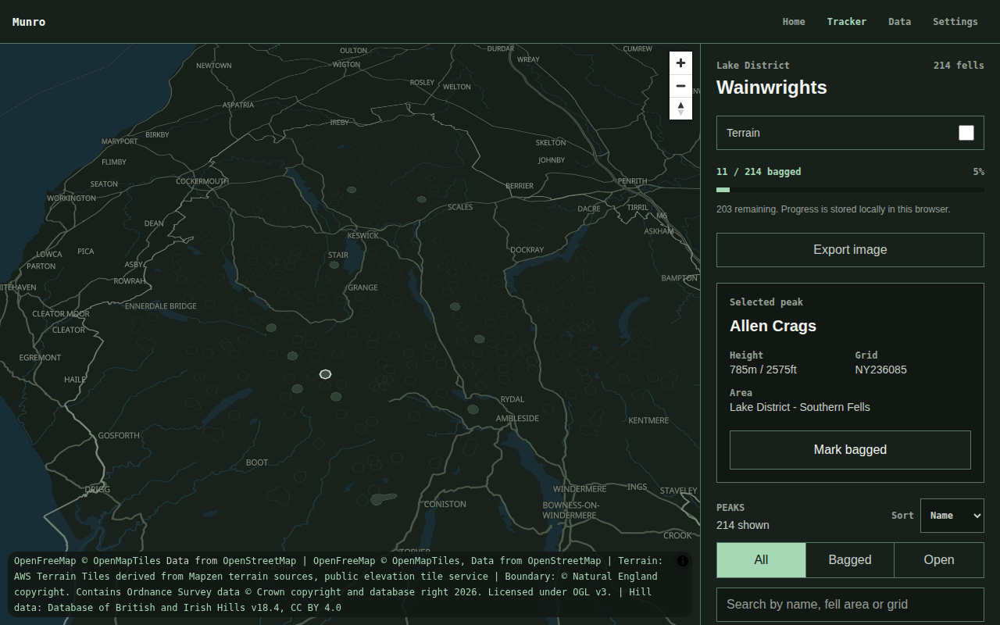

# Munro

A clean, map-first hiking tracker for UK peak bagging.

Munro lets you view the UK's major mountain and fell lists on a dark,
topographic-style map, mark peaks as bagged, track your progress by hill list
or national park, and export a polished, shareable image of your completed
peaks.

The first version is deliberately simple: a flawless tracker — not a social
network, route planner, GPX library or navigation tool. See
[SOUL.md](SOUL.md) for the philosophy behind that choice.

## Description

Open the app, choose a hill list or national park, and see every relevant
peak plotted on a minimal topographic map. Unbagged peaks sit muted grey;
bagged peaks illuminate in a soft green. Click a peak to view its details,
mark it as bagged, and watch your progress update.

Munro is a single product accessible from the **web**, on **iPhone** and on
**Android** devices. The MVP covers the Lake District and the 214
Wainwrights, expanding afterwards to Munros, Corbetts, Grahams, Donalds,
Nuttalls, Hewitts, Marilyns and more. Pushes to `main` deploy the app to
<https://munro.welbournesecurity.com>.

Full product detail lives in the [project wiki](wiki/index.md):

| Page                                               | Contents                                                                                 |
| -------------------------------------------------- | ---------------------------------------------------------------------------------------- |
| [Vision](wiki/vision.md)                           | Core idea, target users, what Munro is and isn't                                         |
| [MVP](wiki/mvp.md)                                 | MVP scope, region, pages, user stories, success criteria — now implemented               |
| [Implementation plan](wiki/implementation-plan.md) | The historical build plan: verified tech decisions, CI/CD design, agentic task breakdown |
| [Features](wiki/features.md)                       | Map view, peak tracking, progress dashboard, image export, local-first storage           |
| [Data](wiki/data.md)                               | Peak and progress schemas, map data sources and licensing                                |
| [Design](wiki/design.md)                           | Visual style, styling guidance, what to avoid                                            |
| [Tech stack](wiki/tech-stack.md)                   | The shipped stack and architectural rules                                                |
| [Platforms](wiki/platforms.md)                     | Web, iPhone and Android strategy                                                         |
| [Operations](wiki/operations.md)                   | Repository settings, deployments and the performance budget                              |
| [Roadmap](wiki/roadmap.md)                         | Non-goals for the MVP and possible future features                                       |

## Visuals



The tracker as shipped: a dark OpenFreeMap basemap, the Lake District
boundary, all 214 Wainwright summits from DoBIH, and generated hill profiles
that light up soft green as fells are bagged. Optional terrain hillshade and
contour lines add mountain context, and the whole view exports as a
shareable image. See [Design](wiki/design.md).

## Installation

Install the web app dependencies:

```sh
npm ci
```

The documentation site is built with [MkDocs](https://www.mkdocs.org/) and the
Material theme:

```sh
pip install -r requirements.txt
```

## Usage

Run the app locally:

```sh
npm run dev
```

Build and preview the production app:

```sh
npm run build
npm run preview
```

Run the checks:

```sh
npm run typecheck    # TypeScript, no emit
npm run lint         # ESLint
npm run format:check # Prettier
npm run test         # Vitest unit and component tests
npm run test:coverage
npm run test:e2e     # production build + Playwright (desktop and mobile)
npm run verify       # typecheck, lint, format:check, test, build
```

Refresh reviewed source data:

```sh
npm run data:peaks
npm run data:boundary
npm run data:hill-boundaries
```

Serve the documentation locally with live reload:

```sh
mkdocs serve
```

Then open <http://127.0.0.1:8000>. To build the static site into `site/`:

```sh
mkdocs build --strict
```

## Support

Questions and ideas are welcome — please open a GitHub issue on this
repository.

## Roadmap

1. **Wainwrights MVP** (built) — Lake District map, bag/unbag tracking,
   local-first storage, progress stats and image export, working well on
   desktop and mobile browsers.
2. **More hill lists** — Munros, Munro Tops, Corbetts, Grahams, Donalds,
   Furths, Nuttalls, Hewitts, Marilyns and UK county tops.
3. **Native reach** — installable experience on iPhone and Android (see
   [Platforms](wiki/platforms.md)).
4. **Later** — accounts and cloud sync, GPX upload, Strava import, offline
   support, poster exports and more: see the full [Roadmap](wiki/roadmap.md).

## Contributing

Before contributing, read [SOUL.md](SOUL.md) and
[CONTRIBUTING.md](CONTRIBUTING.md). Munro has a strong point of view about
staying small and polished, and contributions should fit it. Agent/AI
contributors should read [CLAUDE.md](CLAUDE.md) (also available as
[AGENTS.md](AGENTS.md)).

## Authors and acknowledgment

Peak data is sourced with thanks from the
[Database of British and Irish Hills](https://www.hill-bagging.co.uk/dobih/)
under CC BY 4.0. Boundary data is from Natural England's National Parks
(England) dataset under OGL v3. Basemap tiles are served by
[OpenFreeMap](https://openfreemap.org/) using OpenStreetMap data. Terrain
context uses [AWS Terrain Tiles](https://registry.opendata.aws/terrain-tiles/).

## License

Not yet decided. A licence will be chosen before the first code release.

## Project status

**Wainwrights MVP implemented.** The app is complete against the
[MVP scope](wiki/mvp.md): the map tracker, bag/unbag with dates and notes,
local-first progress with JSON backup and restore, progress stats, image
export, terrain hillshade and contours, and a responsive mobile layout — all
covered by unit, component and end-to-end tests. It awaits merge to `main`
and its first deployment to <https://munro.welbournesecurity.com>. The build
history lives in the [implementation plan](wiki/implementation-plan.md); what
comes next is on the [roadmap](wiki/roadmap.md).
