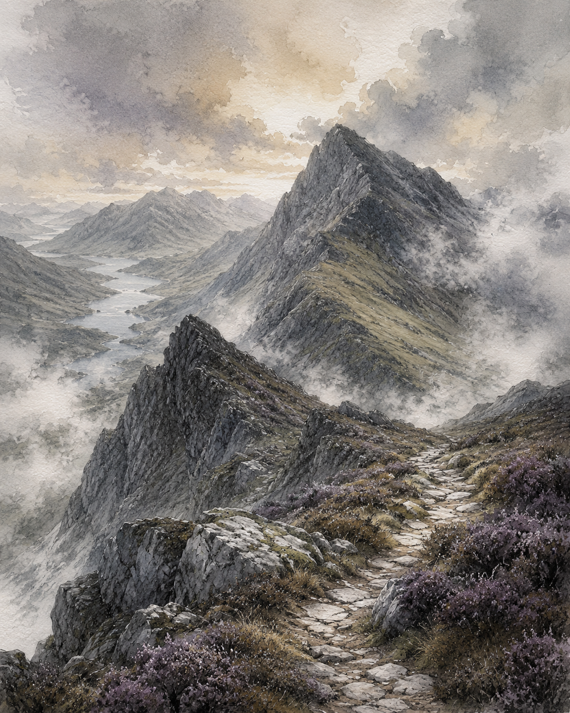

---
hide:
  - navigation
  - toc
---

  <section class="munro-hero" aria-labelledby="munro-hero-title">
    
    <a class="munro-hero__site-cta" href="https://welbournesecurity.com/">
      Back to main site
    </a>

    

      

        
Local-first peak logbook

        <h1 id="munro-hero-title">Project Munro</h1>
        

          A dark, map-first tracker for marking the hills you have climbed,
          keeping your record on your device, and exporting it when you need it.
        

        <svg class="munro-fault" viewBox="0 0 640 38" aria-hidden="true">
          <path d="M2 19 L72 19 L91 9 L136 28 L180 18 L224 18 L245 30 L296 14 L341 23 L393 12 L432 21 L474 20 L509 30 L553 13 L638 19" />
        </svg>
        <ul class="munro-hero__facts">
          <li>Wainwrights first</li>
          <li>No accounts required</li>
          <li>Built for web, iPhone, and Android</li>
        </ul>
      

      <figure class="munro-monolith">
        
        <figcaption>
          01
          Summit record / carved into the map
        </figcaption>
      </figure>
    

  </section>

